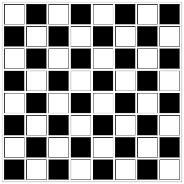

# Papan Catur HTML

Papan catur yang dibuat dengan html tanpa menggunakan css. Papan ini dibuat dengan tag table, dan di setiap tag td di definisikan ukuran lebar tinggi dan warnanya dengan atribut "width", "height", "bgcolor"

